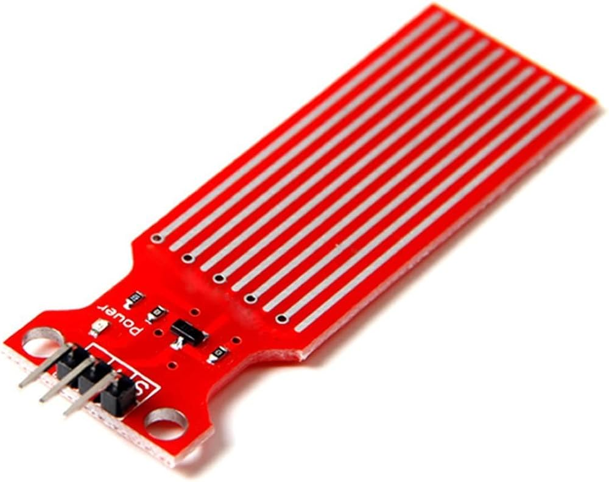
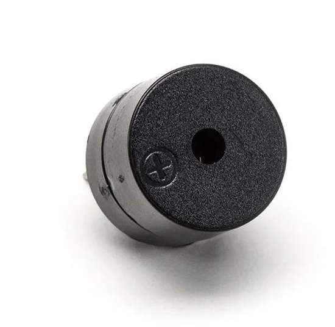
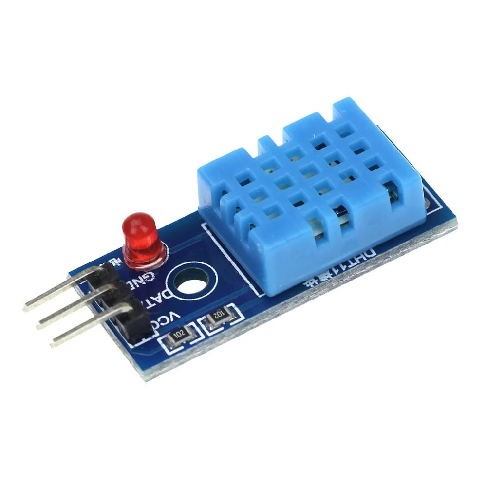
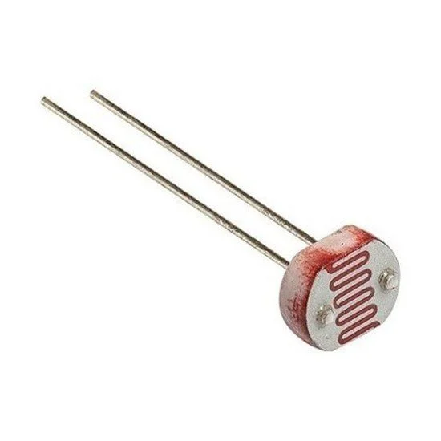
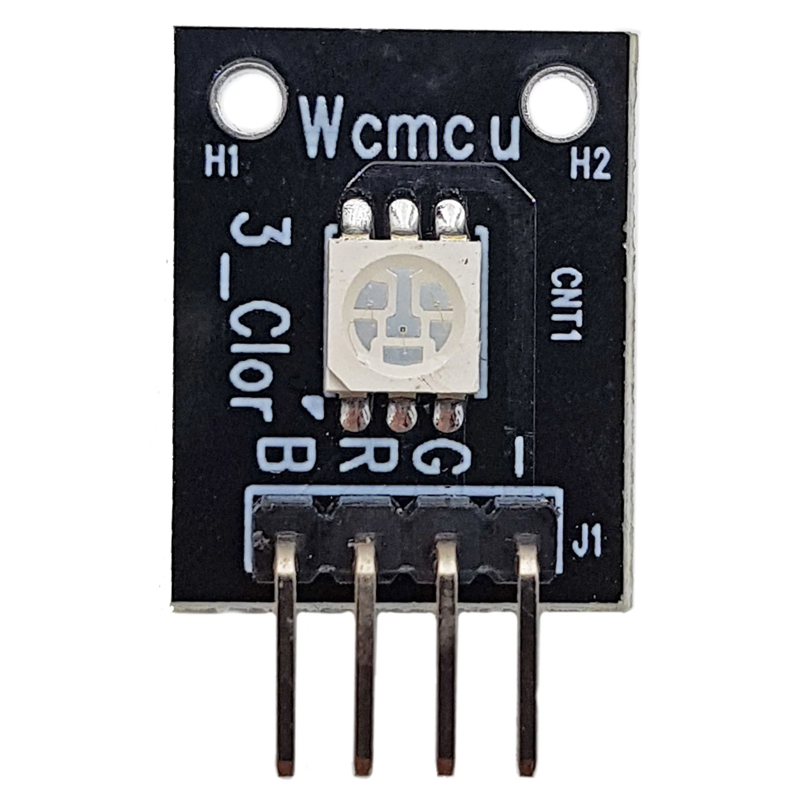
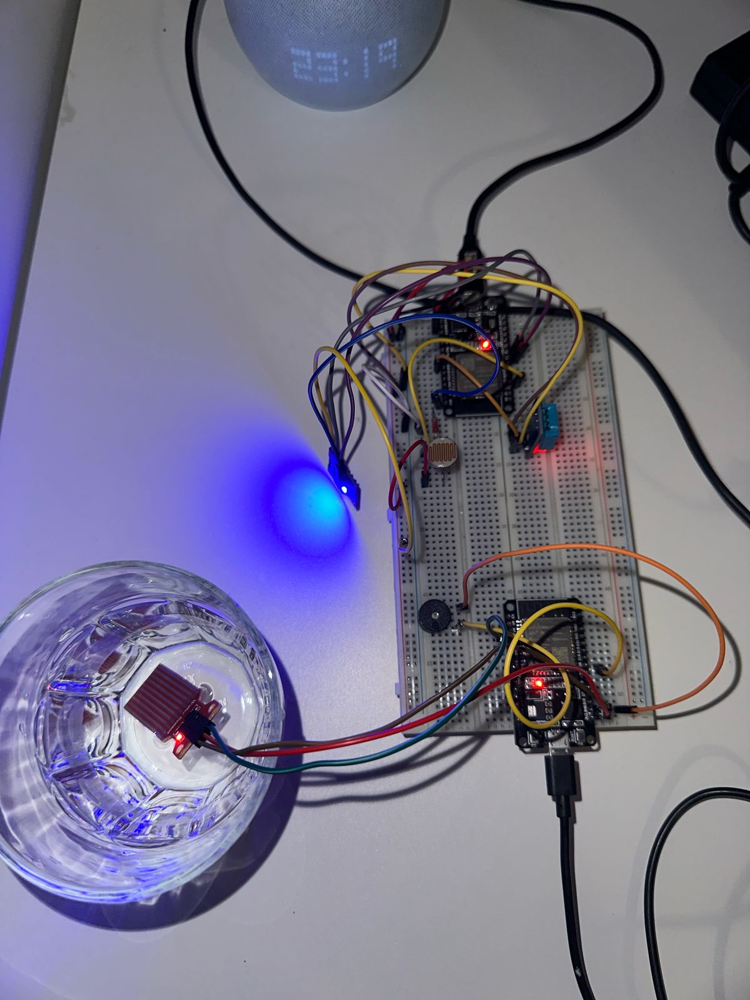

# Flora: Sistema de Monitoramento de Estufa

## [Descrição do Projeto](pplx://action/followup)

Flora é um sistema de monitoramento de estufa desenvolvido para a disciplina de Fundamentos de Sistemas Embarcados. O objetivo principal é criar um ambiente otimizado para o crescimento das plantas, monitorando e controlando as condições ambientais. Para isso, foram utilizadas duas ESP32 conectadas em uma protoboard. O sistema monitora o nível da água, a temperatura e a luminosidade dentro da estufa. Além disso, ele é capaz de acionar alertas sonoros e controlar a iluminação de forma adaptativa.

## [Equipe](pplx://action/followup)
|Nome| Matrícula|
|---|---|
| Gabriel Luiz de Souza Gomes | 190013354 |
| Carlos Eduardo Miranda Roriz | 190011424 |
| Pedro Rodrigues Pereira | 170062686 |
| Cainã Valença de Freitas | 180014412 |

## [Componentes](pplx://action/followup)

### 1. [ESP32 (Bateria)](pplx://action/followup)

A ESP32 (Bateria) tem a função de monitorar o nível da água e alertar sobre situações críticas.

*   **[Função](pplx://action/followup):** Monitorar o nível de água através de um sensor de água e alertar sobre níveis críticos através de um buzzer.
*   **[Conexões](pplx://action/followup):**
    *   Sensor de Água (Water Sensor)
    *   Buzzer Ativo
*   **[Programação](pplx://action/followup):** A ESP32 lê os dados analógicos do sensor de água e, com base em limites predefinidos, ativa o buzzer e/ou um LED interno para indicar níveis críticos de água. O LED é acionado quando o nível de água está abaixo de 30%, e o buzzer emite um alerta sonoro emergencial quando o nível chega a 0%.

#### 1.[1 Sensor de Água (Water Sensor)](pplx://action/followup)

  
   
  <em>Figura 1: Sensor de Água utilizado para medir a presença de água.</em>

*   **[Especificações](pplx://action/followup):**
    *   Tensão de Funcionamento: 5V
    *   Corrente de Trabalho: < 20mA
    *   Saída: Analógica (0 \~ 3.5V)
    *   Área de Detecção: 40mm × 16mm
    *   Tamanho: 65mm × 20mm
*   **[Funcionamento](pplx://action/followup):** O sensor de água mede a umidade do solo ou a presença de água, fornecendo uma saída analógica proporcional à quantidade de água detectada.
*   **[Conexão](pplx://action/followup):** A saída analógica do sensor é conectada a um pino ADC (Conversor Analógico-Digital) da ESP32, permitindo que a placa processe a leitura.

#### 1.[2 Buzzer Ativo](pplx://action/followup)

  
   
  <em>Figura 2: Buzzer Ativo para alertas sonoros.</em>

*   **[Função](pplx://action/followup):** Emitir um sinal sonoro quando o nível de água está abaixo de um limite predefinido (30%), e um alerta mais intenso quando o nível chega a 0%.
*   **[Conexão](pplx://action/followup):** Conectado a um pino digital da ESP32.

### 2. [ESP32 (Energia)](pplx://action/followup)

A ESP32 (Energia) é responsável pelo monitoramento da temperatura e da luminosidade.

*   **[Função](pplx://action/followup):** Monitorar a temperatura e a luminosidade dentro da estufa, controlando um LED RGB para simular a iluminação da estufa de forma adaptativa.
*   **[Conexões](pplx://action/followup):**
    *   DHT11 (Sensor de Temperatura e Umidade)
    *   Sensor LDR (Foto Resistor)
    *   LED RGB WCMCU
*   **[Programação](pplx://action/followup):** A ESP32 lê os dados do DHT11 e do LDR, ajustando a intensidade das cores do LED RGB para simular a iluminação ideal para as plantas.

#### 2.[1 DHT11 (Sensor de Temperatura)](pplx://action/followup)

  
   
  <em>Figura 3: DHT11, sensor de temperatura e umidade.</em>

*   **[Função](pplx://action/followup):** Medir a temperatura ambiente dentro da estufa.
*   **[Conexão](pplx://action/followup):** Conectado a um pino digital da ESP32 para leitura dos dados de temperatura.

#### 2.[2 Sensor LDR (Foto Resistor)](pplx://action/followup)

  
   
  <em>Figura 4: Sensor LDR, foto resistor para medição da intensidade luminosa.</em>

*   **[Função](pplx://action/followup):** Medir a intensidade da luz ambiente. A resistência do LDR diminui com o aumento da luminosidade.
*   **[Conexão](pplx://action/followup):** Conectado a um pino ADC da ESP32, formando um divisor de tensão com um resistor fixo.

#### 2.[3 LED RGB WCMCU](pplx://action/followup)

  
   
  <em>Figura 5: LED RGB WCMCU para simulação da iluminação da estufa.</em>

*   **[Função](pplx://action/followup):** Simular a iluminação da estufa, com a intensidade ajustada de forma inversamente proporcional à luz ambiente medida pelo LDR.
*   **[Conexão](pplx://action/followup):** Os pinos de controle de cada cor (vermelho, verde, azul) do LED RGB são conectados a pinos PWM (Pulse Width Modulation) da ESP32, permitindo o controle da intensidade de cada cor.

## [Montagem](pplx://action/followup)

  
   
  <em>Figura 7: Montagem real dos componentes.</em>

## [Funcionalidades](pplx://action/followup)

*   **[Monitoramento do Nível de Água](pplx://action/followup):**
    *   Leitura contínua do nível de água através do sensor.
    *   Alerta visual (LED da ESP) quando o nível está abaixo de 30% e alerta crítico em 0% (Buzzer).
*   **[Monitoramento de Temperatura](pplx://action/followup):**
    *   Leitura contínua da temperatura ambiente.
*   **[Monitoramento de Luminosidade](pplx://action/followup):**
    *   Leitura contínua da intensidade da luz.
    *   Ajuste automático da intensidade do LED RGB para simular a iluminação natural.
*   **[Controle de Iluminação](pplx://action/followup):**
    *   Simulação da iluminação da estufa através do LED RGB, ajustando a intensidade conforme a luminosidade ambiente.

## [Arquitetura do Software](pplx://action/followup)

O software é dividido em duas partes principais, uma para cada ESP32:

1.  **[ESP32 (Bateria)](pplx://action/followup):**
    *   Rotina para leitura do sensor de água.
    *   Lógica para ativar o buzzer com base nos níveis de água.
2.  **[ESP32 (Energia)](pplx://action/followup):**
    *   Rotina para leitura dos sensores DHT11 e LDR.
    *   Lógica para ajustar a intensidade do LED RGB com base na leitura do LDR.
    
## [Observações](pplx://action/followup)

Inicalmente, o projeto foi desenvolvido em outro repositório, que pode ser consultado em: [Trab3-FSE-Flora](https://github.com/ggomesbr/Trab3-FSE-flora).